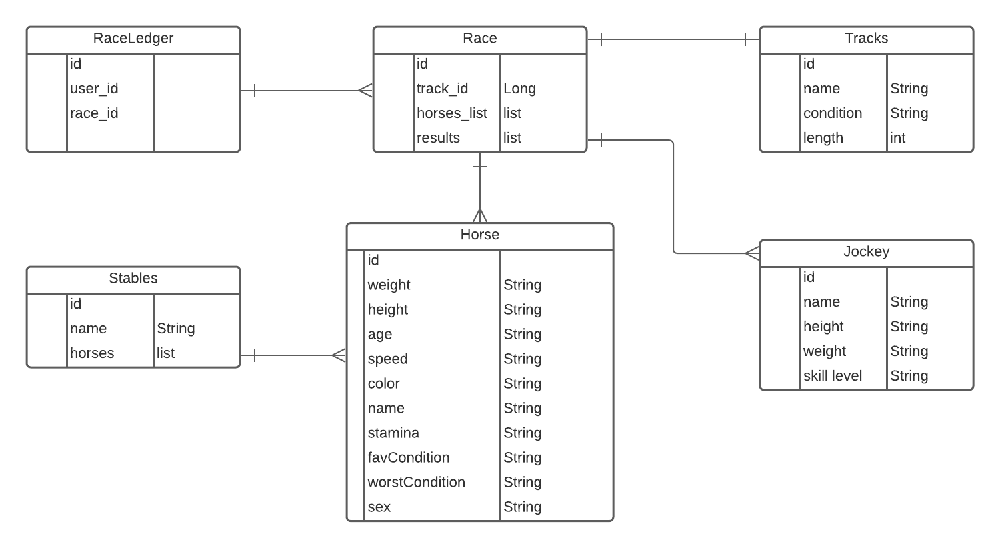
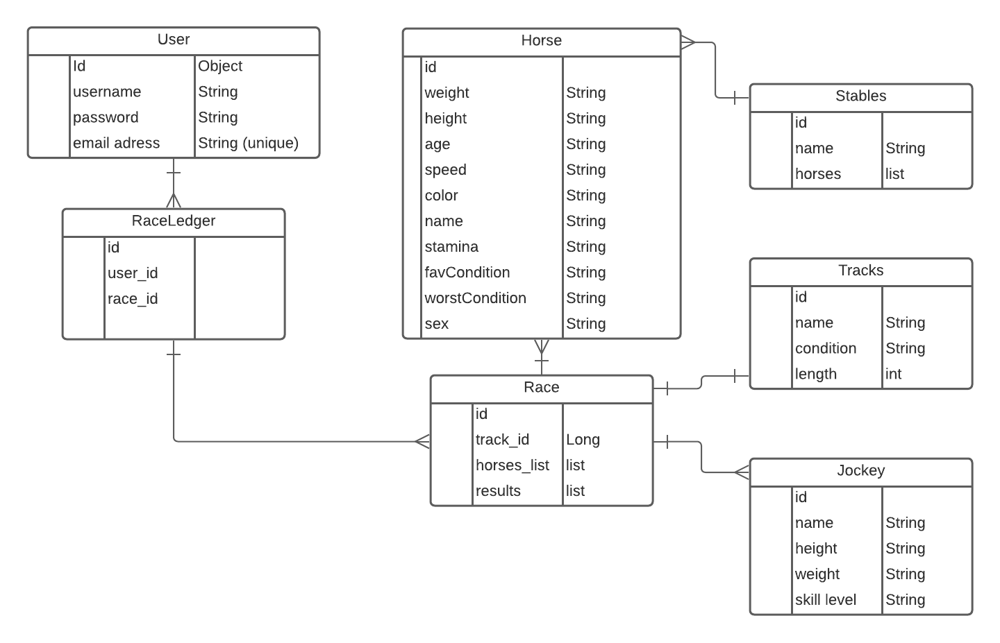
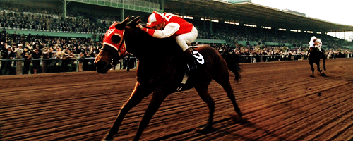

# paypal-java-project-3

## Set Up
1. Mongo will create the database for you. Copy and paste the data from Track_Init_Data.txt into your
horse_racing database. 

## **Welcome to our Horse-Racing App**

This project involved using a REST API for a Horse racing application, which allows for users to select
a horse, jockey and race-track combination to run a simulated race with random results. The results are
based on several factors, which include: horse speed, track condition and jockey skill. Each horse has 
a set speed and condition strength, which can be increased or decreased depending on the track condition. 
The application can be updated with additional horses, jockeys and tracks, which can affect the outcome
of the race. 

## Entity Relationship Diagram (ERD):
The idea was to create an application where a user could simulate an actual horse race with 
variables for horses, jockeys, tracks and conditions. The concept also required a built-in
game of chance in order for a user to actually win using their horse and jockey combination. 

## Original ERD Diagram (ERD):
The original ERD diagram contained a User class for a player to login and play the game. This
was removed due to syntax errors. 

## Model View Controller System Design (MVC):
This project was built using the MVC design, implementing a Model, View, and Controller class. 
Main objective of this structure is "Separation of Concerns" allowing each layer of the application communicate with other layers for data logic and data access and abstraction.
This project consists of: 
1. 7 Model Classes. 
2. 8 different types of Forms for building and sending objects.
3. 6 Service Classes with 6 interfaces.
4. Controller had 25 api endpoints all made public.

## Endpoints

| ENDPOINT | FUNCTIONALITY |
| --- | :--- |
| GET _/api/horse/list_ | GET all Horses
| POST _/api/horse/add_ | ADD a Horse
| POST _/api/horse/addstable_ | ADD a Horse to a Stable
| GET _/api/horse/horseName_ | GET a Horse
| PUT _/api/horse/update/horseName_ | UPDATE a Horse
| GET _/api/jockey/list_ | GET all Jockeys
| GET _/api/jockey/jockeyName_ | GET a Jockey
| PUT _/api/jockey/update/jockeyName_ | UPDATE a Jockey
| POST _/api/jockey/add_ | ADD a Jockey
| GET _/api/allraces_ | GET all Races
| GET _/api/race_ | START a Race
| GET _/api/raceId_ | GET a Race
| PUT _/api/updaterace/raceId_ | UPDATE a Race Entry
| POST _/api/add_ | ADD a Race Entry
| GET _/api/horsename/record_ | GET a Horse Record
| GET _/api/stable/list_ | GET a list of Stables
| GET _/api/stable/stableName_ | GET a Stable
| GET _/api/stable/stableName/horses_ | GET a list of horses in a Stable
| POST _/api/stable/add_ | ADD a Stable
| PUT _/api/stable/update/stableName_ | UPDATE a Stable
| GET _/api/track/list_ | GET a List of Tracks
| GET _/api/track/trackName_ | GET a Track
| POST _/api/track/add_ | ADD a Track
| PUT _/api/track/update/trackName_ | UPDATE a Track
| DELETE _/api/track/delete_ | DELETE a Track

## System Tools Used

|  |  |
| --- | :--- |
| Spring Boot | IntelliJ IDEA/Java 11 and 17 |
| Apache Maven | MongoDB |
| Postman | Mongo Docs |
| Lucid App | Google |

 

## User Stories

| |
| :--- |
| 😀 **MVP** 😀 |
|1. As a user, I would like to select a horse and jockey combination.|
|2. As a user, I would like the option to set all horses in a race.
|3. As a user, I want to know if my horse won the race.
|4. As a user, I want to view all horses.
|5. As a user, I want to view all stables.
|6. As a user, I want to view all tracks.
|7. As a user, I want to view all jockeys.

| |
| :---
| 😎 **Silver** 😎|
|8. As a user, I would like to log in.
|9. As a user, I would like to update my password.
|10. As a user, I would like to create a horse.
|11. As a user, I would like to create a jockey.
|12. As a user, I would like to be able to set the length of the track.
|13. As a user, I would like to select a type of track.

| |
| :---
| 🔥🔥 **Gold** 🔥🔥 |
|14. As a user, I would like to keep a horse record win/loss.
|15. As a user, I want to see the results of the race.
|16. As a user, I want my horse to have a level of chance regarding stats.
|17. As a user, I want to see my list of bets.

## Project Challenges

1. Adding a user with login credentials was a significant challenge as this class created
    a ***Data type converter error***. When running the user credentials in Postman, the error 
    failed to authenticate using the JWT Utils. This error caused several hours or lost productivity
    and after rebuilding the class, the error persisted. This idea was scrapped as the error 
    may be system related. 

2. One to many

3. Queries

4. ref docs vs external docs

5. database init

##Thanks for Playing

###**Go Seabiscuit!** 

